# Benchmarks

## Benchmarking methodology

Benchmarks are run by `cargo bench`. Time and throughput are obtained on an AMD EPYC 9575F for GFNI and AVX2, and on an NVIDIA GH200 for NEON, for input-output buffers aligned to 64 bytes. Throughput is measured in the number of message input payload bytes, not including parity. Aligned input-output buffers yield better results on average.

We run benchmarks for n a power of 2 from 2 to 256 and fix the number T of parity shards to n/2. Benchmarked shard lengths are 64 B, 1 KiB and 64 KiB.

## Main RS codec methods

### `Codec::encode_systematic_sharded`

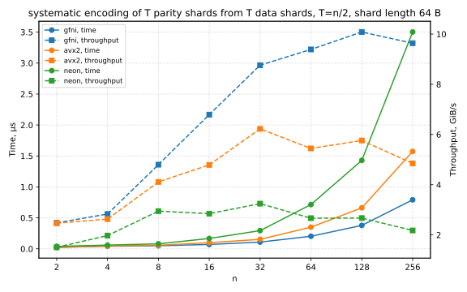
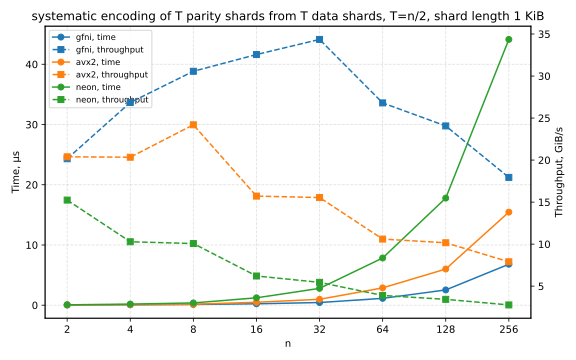
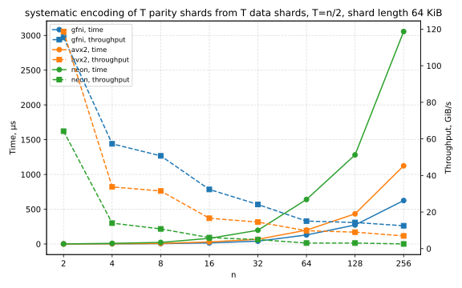

### `Codec::recover_erasures_sharded_clobber`

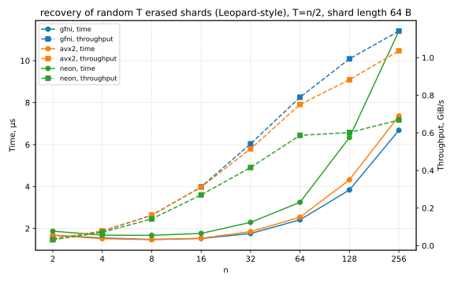
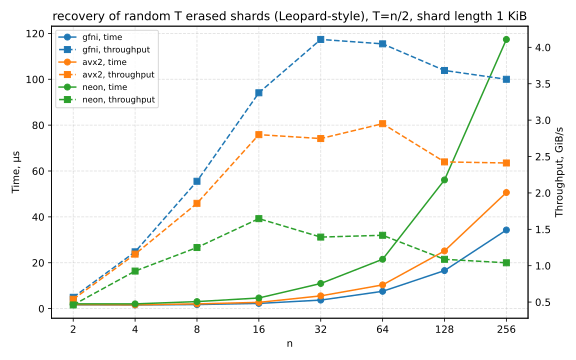
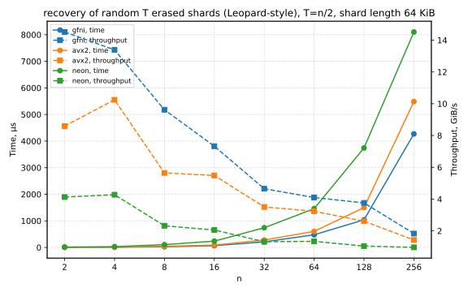

### `Codec::recover_erasures_sharded`

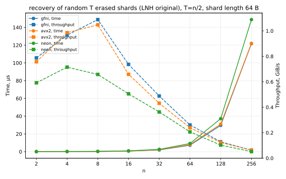
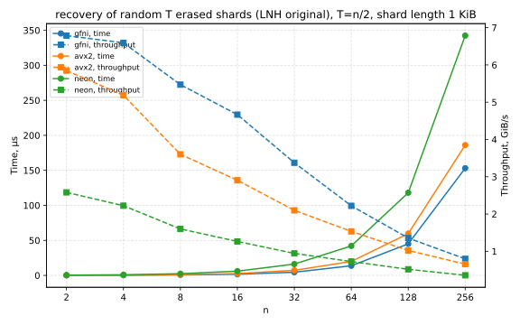
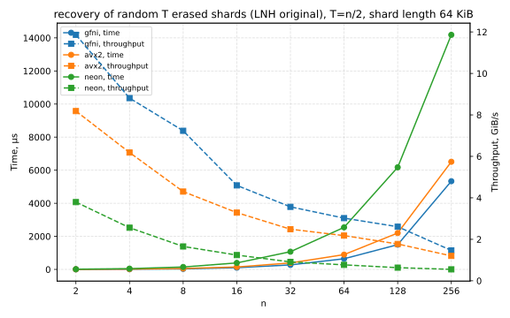

## Transforms

## `Kernel::fft_sharded`

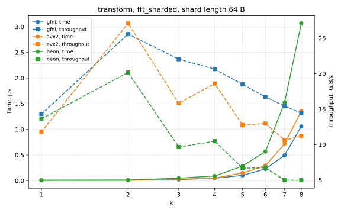
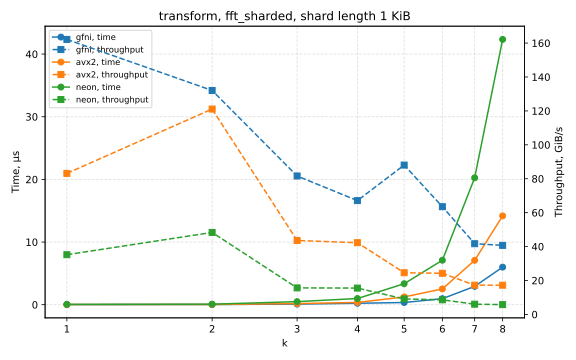
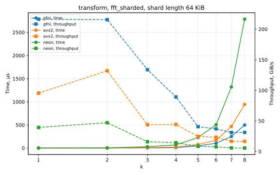

## `Kernel::fft_sharded_dit2`

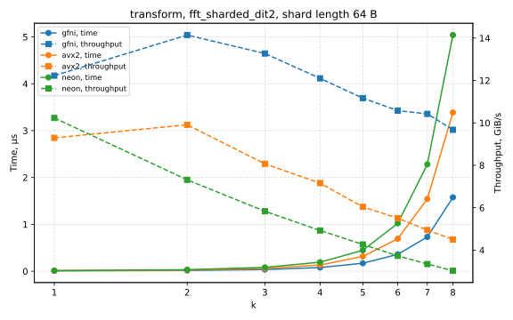
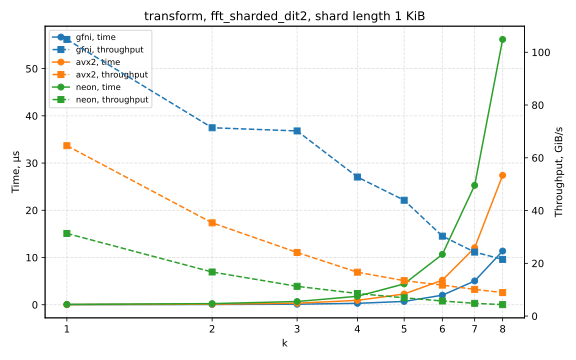
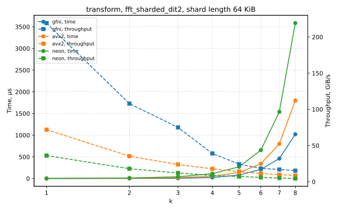

## `Kernel::fft_sharded_dit4`

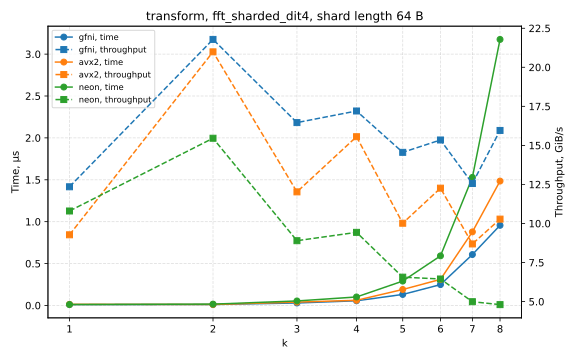
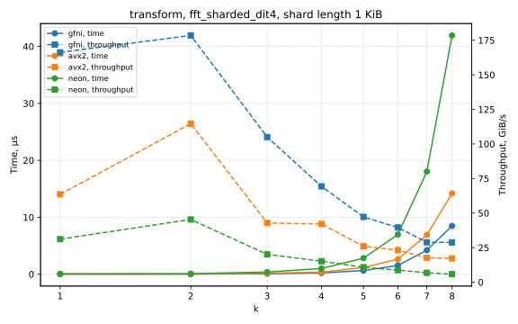
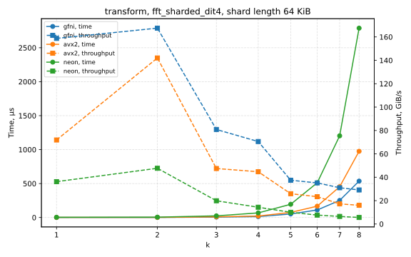

## `Kernel::fft_sharded_radix2_last`

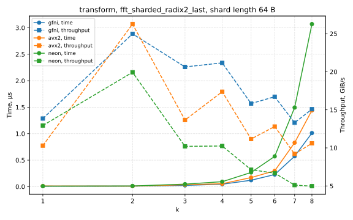
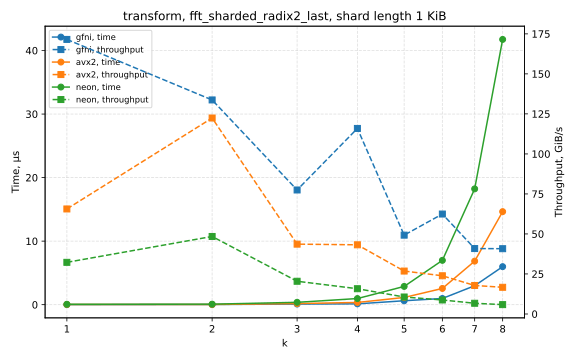
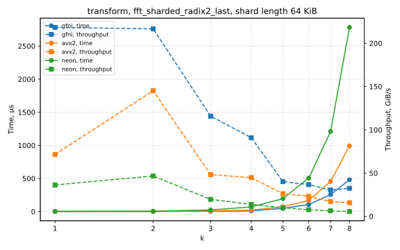

## `Kernel::ifft_sharded`

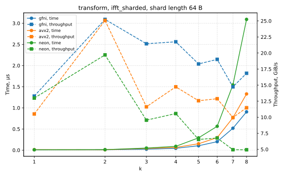
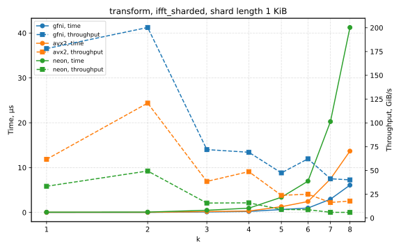
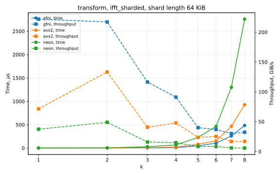

## `Kernel::ifft_sharded_dit2`

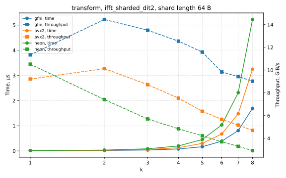
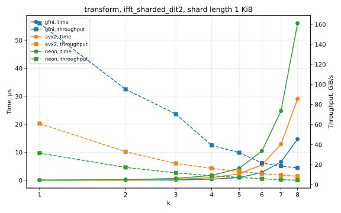
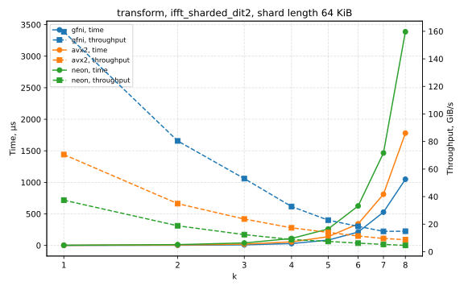

## `Kernel::ifft_sharded_dit4`

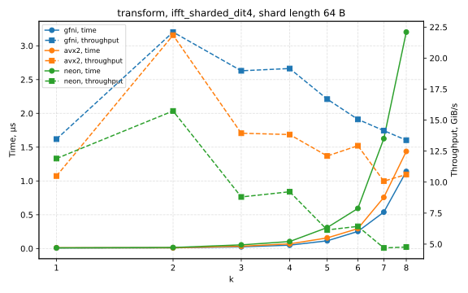
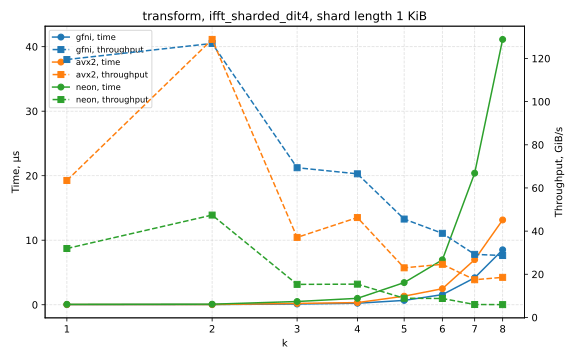
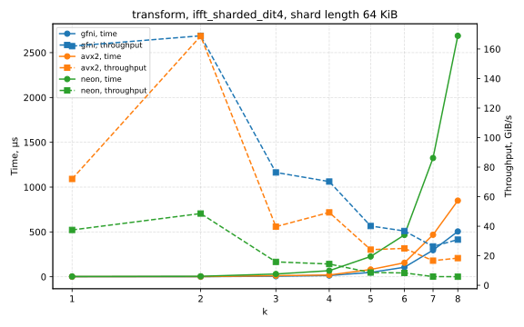
